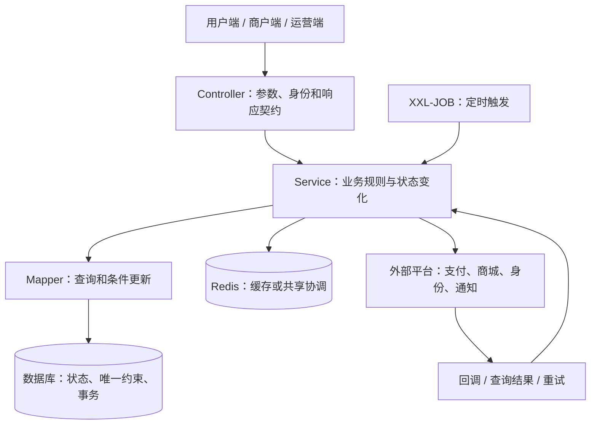

> 内部学习材料；来源：2026-09-09代码作者评审。Owner：沈砚舟。
> 接手修正：下文保留当时报告原貌。默认以水订单作为首课的建议已被新提供的业务范围资料替代；后端培训采用家政维修与双生态主线。详见 ../employees/backend-training-architect/ONBOARDING.md。人员判断仅为代码抽样，不是岗位职级结论。

# Mephisto 作者观察与后端导师选择

分析日期：2026-09-09。用途：个人学习和导师试选；不是绩效考核或职级鉴定。

## 范围与可信度

- 仓库：`$VANKE_WORKSPACE_ROOT/daojia/mephisto`。本次没有同步或评价旁边两个仓库，不能把结果推广到团队所有系统。
- 已从 GitHub 获取最新 main，基线 `bdb5dc31fa89d2cfdffea06321afc0aea2d8eb8f`，提交时间 2026-09-03 18:09:20 +08:00。
- 原工作区干净，位于 master。现切换到 `codex/main-author-study-20260909`，从 origin/main 创建并跟踪它。没有改业务代码、提交或推送；本报告保存在仓库外。
- 核心观察窗口为 2026-07-09 00:00:00 至 2026-09-09 23:59:59，时区 Asia/Shanghai；检查 main 可达的非 merge 提交，结合当前实现、父提交差异、测试和更早历史。
- Git 作者、提交者、合并人、实际设计者、AI 操作者不是天然相同的人。文档和测试能证明仓库产物，不能单独证明作者能脱离辅助独立完成设计。
- 作者相同邮箱的历史别名包括 `池松涛 / chist01_onewo / unknown`。这支持可能同人的判断，不足以确认所有 unknown 都对应同一自然人；不按 unknown 另评职级。
- `AGENTS.override.md` 在工作区及已检查的上级目录中缺失，Maven 初始化参数无法按仓库要求确认。本次未运行 Maven、未访问业务数据库、未进行运行时或并发复现。文中“存在测试”不等于“本次测试通过”。

| Git 作者标签 | 两个月非 merge 提交 | 唯一补丁 | 触及测试文件的提交 | 解释 |
|---|---:|---:|---:|---|
| 彭元兵 | 72 | 72 | 47 | 组合商品密集交付，含设计、文档、修复，不能当成72个独立功能 |
| 池松涛 | 41 | 35 | 35 | 6组相同补丁被重复纳入历史，不能双倍计工作量 |
| 何勋帅 | 40 | 40 | 18 | 包含7月9日完整一天的7个提交，不能用默认时分秒的日期过滤漏算 |
| 苏晓群 | 7 | 7 | 0 | 近期7个提交都标记 `[#AI]`；无近期测试变更不代表没有手工验证 |
| liangcx08_onewo | 1 | 1 | 1 | 样本不足，无法评价综合水平 |
| unknown | 1 | 1 | 0 | 身份待核实，不另列人物等级 |

“唯一补丁”使用 `git patch-id --stable` 对各非 merge 提交差异去重；测试触及数未去重，仅说明证据分布，不用于排名。最近一个月（8月9日起）主要活跃样本来自池松涛、苏晓群和何勋帅；彭元兵本次主要材料集中在7月下旬至8月上旬，不能因为最近一个月没有新提交就判定水平下降。

## 导师选择结论

**按你当前阶段，建议先请何勋帅试带一条订单有效期业务；彭元兵作为交易建模进阶专题首选，池松涛作为业务联调与存量修复专题首选，苏晓群作为SQL、激励计算与批处理专题首选。** 这是学习适配顺序，不是四人的绩效排名。若池松涛或苏晓群更愿意稳定带你拆需求、评审代码，也完全可以成为更合适的主导师。

为什么先试何勋帅：你的主课题正在从任务领取走向实际业务状态推进，他的有效期需求正好覆盖“创建时冻结规则、到期扫描、售后流转、历史兼容”，可以拆成你能承受的小课。为什么不直接先读彭元兵全部组合商品：它涉及较多金额和履约对象，学习价值很高，但容易再次出现看懂局部、无法独立起步。

如果一定用“水平”表达，当前更可辩护的是下面这些**能力信号**。这里的“中级”指能处理多表、状态、异常的业务功能，“高级设计信号”指能处理生命周期、跨入口规则统一、历史数据与恢复边界，不等同于公司职级。

| 作者 | 当前可支持的水平判断 | 最有证据的强项 | 不能据此确认的能力 |
|---|---|---|---|
| 彭元兵 | 复杂交易业务的中高级设计信号最突出 | 快照、权益、履约、退款分摊、历史修复、契约 | 全面架构师能力、性能容量治理、基础带教能力；回归一致性有缺口 |
| 何勋帅 | 有经验的业务后端特征，具备中级以上功能拆解信号 | 订单状态、时间边界、事务落点、条件更新、业务文档 | 并发可靠性与权限设计始终严谨；文档和测试持续同步 |
| 池松涛 | 有经验的业务交付和集成特征，具备中级以上落地信号 | 业务归属、回调关联、外部接口、兼容兜底、局部修复 | 可靠送达、完整资金闭环、测试工程和全面架构能力 |
| 苏晓群 | SQL与规则计算有跨年经验信号，具备中级以上业务处理特征 | 聚合口径、金额计算、逐项事务、账户分组、业务审计 | SQL性能优化深度、任务重跑与双步骤补偿完整性、自动化验证深度 |
| liangcx08_onewo | 暂不定级 | 单个规则抽取与测试案例质量值得参考 | 综合能力、经验范围、导师适配 |

四位都有明显超出“只会写简单接口”的产物；也都没有足够证据让我们直接确认“全栈式资深后端/架构师”。这不是刻意保守：抽样已经发现具体的失败恢复和测试维护问题。源码能帮助筛选试带对象，但无法观测他们口头解释、评审他人方案、应对故障和持续教学的表现。

## 彭元兵：学业务对象如何跨越整个交易生命周期

**风格：**先整理设计、契约与数据模型，再实现商品和订单链路，随后按问题细化修复；命名常使用 `snapshot`、`entitlement`、`lifecycle`、`bundle` 等领域词。近期提交经常关联需求编号，便于追溯理由。结构和文档中存在AI协作证据，不能将排版和篇幅直接当作个人水平。

**最有价值的三个样本：**

1. `696c1b46f / a9b962657 / ea8c4dff8`：组合商品基础模型、编写生命周期、订单权益与履约。看 BundleOrderServiceImpl.java:164（`$VANKE_WORKSPACE_ROOT/daojia/mephisto/src/main/java/com/vanke/maintain/goods/bundle/service/impl/BundleOrderServiceImpl.java:164`），理解为什么商品当前配置不能直接代表旧订单购买时的价格、费率和组件。购买时冻结快照，把“现在卖什么”和“当时承诺了什么”分开。
2. `6e2875e05`：取消后重新预约的结算尾差。看 金额分配:637（`$VANKE_WORKSPACE_ROOT/daojia/mephisto/src/main/java/com/vanke/maintain/goods/bundle/service/impl/BundleOrderServiceImpl.java:637`）。剩余金额依据冻结总额减去有效服务单已分配金额计算，不能只按次数机械乘单价。这里值得学的是金额守恒和撤销后的重算依据。
3. `6b0ebb951`：历史结算修复支持 dry-run，并对已有结算流水作限制。看 BundleSettlementHistoryRepairServiceImpl.java:97（`$VANKE_WORKSPACE_ROOT/daojia/mephisto/src/main/java/com/vanke/maintain/settle/service/impl/BundleSettlementHistoryRepairServiceImpl.java:97`）。这是“知道什么时候不能直接更新数据库”的设计信号。

更早的 `d563d54ef / c708a0d83`（2026-05）已涉及宠物档案与订单快照，说明快照区分并非只在7月出现；仍不据此推断每个方案独立完成。

**常用技术：**Spring事务、MyBatis/MyBatis-Plus、乐观锁版本和条件更新、唯一约束、BigDecimal分摊、枚举与业务错误、JUnit/Mockito、Mapper集成测试、设计与接口文档。

**明确局限：**`65de05062` 修改当前退款算法后，实际实现:140（`$VANKE_WORKSPACE_ROOT/daojia/mephisto/src/main/java/com/vanke/maintain/order/handler/OrderAfterSaleHandler.java:140`）调用 `calculateUsedAmount()`；现存测试:43（`$VANKE_WORKSPACE_ROOT/daojia/mephisto/src/test/java/com/vanke/maintain/order/handler/OrderAfterSaleHandlerBundleRefundTest.java:43`）仍模拟 `calculateRemainingRefundAmount()` 并期待与当前执行不一致的结果。静态可以确认脱节，本次没有运行测试，因此不报告执行失败数量。

测试中有真实数据库用例，例如 权益Mapper集成测试:48（`$VANKE_WORKSPACE_ROOT/daojia/mephisto/src/test/java/com/vanke/maintain/goods/bundle/mapper/OrderBundleEntitlementMapperIntegrationTest.java:48`），覆盖自增ID与重复唯一键；也有SQL字符串和模拟对象检查。前者的顺序重复插入仍不能替代两个独立事务同时操作的并发证据。

**跟学顺序：**商品配置→订单快照→权益次数→预约扣减与取消归还→金额分摊→历史修复。最值得问：“商品涨价以后旧订单为什么不能跟着变？两人争最后一次权益怎么办？取消重约后尾差落在哪里？哪类结算记录绝不能直接回刷？”

## 何勋帅：学如何把需求拆成状态、时序与数据变化

**风格：**先写较完整方案，再按阶段交付，复用历史服务，补充业务分支测试，并在后续提交纠正边界。优势是业务步骤相对好追踪；局限是方案、代码、测试三个版本未始终同步。

**最有价值的样本：**

- `99ff98b69` 等7月9日七个提交是方案演进，尚非Java实现。它们区分商品配置、订单有效期快照、卫星表与定时阶段。真正落库可看 `2fdb1f44e` 及 有效期创建:105（`$VANKE_WORKSPACE_ROOT/daojia/mephisto/src/main/java/com/vanke/maintain/order/service/impl/WaterOrderValidityServiceImpl.java:105`）。
- `44e35367b` 把有效期校验和落库从提交后监听改进下单事务，见 调用点:2542（`$VANKE_WORKSPACE_ROOT/daojia/mephisto/src/main/java/com/vanke/maintain/order/service/impl/ServiceOrderServiceImpl.java:2542`）。这值得你学习“校验必须发生在什么时间，才真能阻止错误订单”。
- `86967aedb` 停止按当前商品配置补算历史无快照订单，见 resolveExpireTime:154（`$VANKE_WORKSPACE_ROOT/daojia/mephisto/src/main/java/com/vanke/maintain/order/service/impl/WaterOrderValidityServiceImpl.java:154`）。这体现新规则与旧数据的兼容边界。
- `0c10d8913` 的改派流程重新读取订单、校验候选人，再使用条件SQL并检查影响行数，见 Service:58（`$VANKE_WORKSPACE_ROOT/daojia/mephisto/src/main/java/com/vanke/maintain/order/service/impl/WaterItemOrderReassignServiceImpl.java:58`）和 Mapper XML:6075（`$VANKE_WORKSPACE_ROOT/daojia/mephisto/src/main/java/com/vanke/maintain/order/mapper/ServiceOrderItemMapper.xml:6075`）。前端传来的旧状态不能作为最终依据。

**常用技术：**日期与配置、状态枚举、Mapper条件更新、Spring事务、XXL-JOB扫描、公共Handler复用、审计记录和Mockito分支测试。

**三个值得试讲的真实边界：**

1. 自动售后:409（`$VANKE_WORKSPACE_ROOT/daojia/mephisto/src/main/java/com/vanke/maintain/order/service/impl/WaterOrderValidityServiceImpl.java:409`）先调用另一服务的事务方法创建售后，再更新有效期卫星表，外层编排未形成覆盖两步的事务。若前一步提交而后一步失败，下轮可能因主订单已有进行中售后而跳过；自动同意任务又依赖卫星表的 `AFTER_SALE_CREATED`。这条任务链存在自行恢复的缺口，不等于已证实线上事故。
2. 通知发送:349（`$VANKE_WORKSPACE_ROOT/daojia/mephisto/src/main/java/com/vanke/maintain/order/service/impl/OrderSendMessageImpl.java:349`）捕获异常后返回，调用方:352（`$VANKE_WORKSPACE_ROOT/daojia/mephisto/src/main/java/com/vanke/maintain/order/service/impl/WaterOrderValidityServiceImpl.java:352`）继续标记提醒完成。发送失败与业务成功之间缺少可靠反馈。
3. `3db721b66` 撤掉批量到期日查询的用户归属条件。当前接口:545（`$VANKE_WORKSPACE_ROOT/daojia/mephisto/src/main/java/com/vanke/maintain/order/controller/ServiceOrderController.java:545`）检查登录，但局部查询只按订单ID。若无外部数据权限约束，存在跨用户查询订单到期日的边界问题；不能扩大为整个系统无鉴权。

需要公平评价：没有确认他的重点链路存在“同类自调用导致整条事务失效”。下单的外层入口已有事务，内部调用可以沿用；真正要分析的是事务覆盖范围。不要看到私有方法就机械判错。

部分Mockito测试叫“回滚”或“并发冲突”，实际只模拟抛异常、更新0行，不能证明真实数据库行为。文档仍保留早期提交后落库等旧描述，所以带你学时必须对照当前实现。

**跟学顺序：**画订单对象关系→定义合法状态变化→创建时规则快照→到期扫描→失败恢复→真实并发测试。最值得问：“售后已创建、卫星表没写成，下次怎样恢复？登录和订单归属差在哪？更新0行意味着什么？哪个异常会回滚哪些表？”

## 池松涛：学业务归属、外部联调与历史兼容

**风格：**围绕实际需求和联调问题连续迭代，擅长补充业务例外与配置缺失兜底；在已有大Service中局部修复较多。提交说明有“调整接口”“修复代码”等较泛表述，也有清晰的领域修复与测试，记录质量不完全一致。

**最适合你精读的样本：**

- `6dd63285c → 780606bf9`：第三方接单时，哪些情况下保留原供应商，哪些标准供应商可替换。看 ItemOrderServiceImpl.java:7707（`$VANKE_WORKSPACE_ROOT/daojia/mephisto/src/main/java/com/vanke/maintain/order/service/impl/ItemOrderServiceImpl.java:7707`）。学习的是来源、归属和例外矩阵，不只是几个if。
- `431e8d667`：支付回调按支付记录原本绑定的加价单处理，不能按当前“最新加价单”推断。看 回调关联:3664（`$VANKE_WORKSPACE_ROOT/daojia/mephisto/src/main/java/com/vanke/maintain/order/service/impl/ItemOrderServiceImpl.java:3664`）。这是异步请求必须依赖稳定业务身份的好例子。
- `77305b65c` 与更早 `e8248b734`：商品变更前做快照，金额用 `compareTo` 判断实际变化，事务提交后再通知外部商城。见 快照:49（`$VANKE_WORKSPACE_ROOT/daojia/mephisto/src/main/java/com/vanke/maintain/goods/service/impl/GoodsKeyFieldChangeSnapshot.java:49`）、通知登记:1136（`$VANKE_WORKSPACE_ROOT/daojia/mephisto/src/main/java/com/vanke/maintain/goods/service/impl/GoodsServiceImpl.java:1136`）。这里与已学的afterCommit有直接联系。
- `1817a3ed1`：朴里节循环链接分配使用Redis WATCH/MULTI/EXEC及有限重试，见 PuliSilverUvServiceImpl.java:82（`$VANKE_WORKSPACE_ROOT/daojia/mephisto/src/main/java/com/vanke/maintain/puli/service/impl/PuliSilverUvServiceImpl.java:82`）。展示与实际点击分开，配置缺失时用户信息有兜底。适合从前端事件过渡到后端共享状态。

更早 `d1bb84cee`（2026-06）部分退款按累计应退减之前应退处理积分取整，见 CloudPointPaymentServiceImpl.java:391（`$VANKE_WORKSPACE_ROOT/daojia/mephisto/src/main/java/com/vanke/maintain/order/service/impl/CloudPointPaymentServiceImpl.java:391`）。学习时以当前规则为准，不能把被恢复的历史积分比例当作现行口径。

**常用技术：**HTTP/SDK、外部字段适配、登录上下文、配置解析、Spring事务与afterCommit、Redis事务、BigDecimal、Mockito/反射局部回归。

**明确局限：**商品通知:1172（`$VANKE_WORKSPACE_ROOT/daojia/mephisto/src/main/java/com/vanke/maintain/goods/service/impl/GoodsServiceImpl.java:1172`）目前调用HTTP后记录成功日志、异常只记日志，未见该路径持久化待发送记录或解析业务成功结果。afterCommit能把通知推迟到提交后，但不能保障提交后崩溃、网络失败时一定补发。这个区别非常值得你学。

测试中 MemberOrderControllerTest.java:85（`$VANKE_WORKSPACE_ROOT/daojia/mephisto/src/test/java/com/vanke/maintain/order/thirdapi/MemberOrderControllerTest.java:85`）用两次新建的 `singletonList` 做 `assertSame`，引用比较本身不成立；另有Redis测试模拟EXEC冲突，尚不能证明真实双请求竞争。不能因为近期多次改测试就认定验证闭环完善。

**跟学顺序：**供应商归属→接口身份与配置兜底→回调关联→外部通知→部分退款。最值得问：“对方超时但实际已经成功怎么办？同一业务重试如何识别？为什么数据提交后通知仍可能丢？旧付款单迟到成功怎么办？”

## 苏晓群：学SQL口径、计算规则和逐项事务

**风格：**业务步骤直白，集合分组、SQL聚合和逐条处理较多；倾向沿现有模型扩展字段、配置、状态和过程记录。近期7个提交明确AI标记；早期2025年也有完整业务样本，因此不能把其能力简单归因于近期工具使用。

**跨时期可支持的强项：**

- `70ddca6c0`（2025-05）从订单数据按人员、组织、月份统计承揽费指标，见 ExclusiveHandlingFeeCalculateMapper.xml:7（`$VANKE_WORKSPACE_ROOT/daojia/mephisto/src/main/java/com/vanke/maintain/employeereward/mapper/ExclusiveHandlingFeeCalculateMapper.xml:7`）。`5c1055f2f`（2025-08）同时调整SQL字段与回收率公式分母，体现数据口径和计算代码的联动。
- 计算服务:81（`$VANKE_WORKSPACE_ROOT/daojia/mephisto/src/main/java/com/vanke/maintain/employeereward/service/impl/ExclusiveHandlingFeeCalculateServiceImpl.java:81`）通过Spring获取服务Bean，再逐人调用事务方法。可以用来解释为什么单条失败不应回滚整批，以及为什么直接this调用不能产生新的代理增强。
- `d06fe29ac → 45a143363` 的 expireReward:1575（`$VANKE_WORKSPACE_ROOT/daojia/mephisto/src/main/java/com/vanke/maintain/employeereward/service/impl/EmployeeRewardServiceImpl.java:1575`）在事务里锁记录、重新检查待确认状态、写EXPIRED状态和系统流程记录。相比仅扫描后直接更新，这具有明确的并发和审计意识。

**常用技术：**MySQL聚合与JOIN、Java集合分组和日期换算、BigDecimal、配置化业务公式、Spring代理与事务、FOR UPDATE、XXL-JOB、流程枚举。

**最需要追问的两个边界：**

1. 历史专职激励任务 EmployeeExclusiveRewardClearGenJob.java:104（`$VANKE_WORKSPACE_ROOT/daojia/mephisto/src/main/java/com/vanke/maintain/employeereward/job/EmployeeExclusiveRewardClearGenJob.java:104`）分别执行企服与管家清分；下轮 查询:896（`$VANKE_WORKSPACE_ROOT/daojia/mephisto/src/main/java/com/vanke/maintain/employeereward/mapper/EmployeeRewardMapper.xml:896`）却只以企服侧 `has_gen_clear=false` 筛选。企服成功、管家失败后，这个任务会漏选需要补做管家的记录。是当前路径的恢复缺口，不是已经确认的线上漏账；底层两个清分服务也不能全归给同一作者。
2. 月度计算可指定月份重跑，但可见代码每次生成新code并插入；若数据库没有员工、月份、组织等业务唯一约束，部分成功后重跑可能重复生成。必须查实际约束与业务补算语义，不能因为流水号唯一就认为任务幂等。查询JOIN也要确认关联表是否唯一，否则聚合可能放大，不能只凭SQL复杂就认定性能或准确性优秀。

近期过期扫描另依赖 `is_scan_expired` 字段，已查源码未找到置位或迁移来源；需要核实上线数据准备。单批500条和逐条异常日志已有，但失败隔离、后续批次推进与调度失败汇总的证据不足。没有看到这些关键重跑和部分失败边界的自动化回归。

**跟学顺序：**业务指标定义→小数据集手算→SQL聚合→Java公式→事务与流程记录→重跑和补偿。最值得问：“100人处理到第60人退出，重跑如何不重复？第一路清分成功、第二路失败，哪条SQL会重新选中？配置表多一行为什么可能把金额翻倍？”

## 样本不足者和不应照搬的习惯

`liangcx08_onewo` 的 `88331a56a` 把规则抽到 HomeServiceBaseProfitPolicy.java:30（`$VANKE_WORKSPACE_ROOT/daojia/mephisto/src/main/java/com/vanke/maintain/employeereward/service/HomeServiceBaseProfitPolicy.java:30`），并有 7个JUnit规则测试:17（`$VANKE_WORKSPACE_ROOT/daojia/mephisto/src/test/java/com/vanke/maintain/employeereward/service/HomeServiceBaseProfitPolicyTest.java:17`）。这是初学者很适合复刻的小样本，但只有一个近期提交，不能评综合水平，更不能排在他人前后。unknown与既有作者的别名关系需本人确认。

不要照搬的共同习惯：用日志代替失败状态；用“加了事务”代替说明提交边界；用Mock证明真实回滚或竞争；规则变化后不检查旧文档和断言；用大Service和零散条件承接所有复杂性。上述问题的意义是为学习找到反例，不是从几处缺陷推断人的性格、责任心或完整能力。

## 这个仓库能教你什么

它是一个 Spring Boot 部署应用，内部共存商品、订单、履约、供应商、结算、水业务、员工激励和外部集成。连接其他平台并不意味着每个业务包都是一个独立微服务。入口可核对 Application.java（`$VANKE_WORKSPACE_ROOT/daojia/mephisto/src/main/java/com/vanke/maintain/Application.java:12`）。

图是学习所用的职责图，不表示每次请求都会经过全部节点，也不表示上述系统都属于一个数据库事务。

| 实际技术与项目形态 | 你需要理解的职责 | 读代码时要问什么 |
|---|---|---|
| Java、Spring MVC、注入、DTO/VO、枚举 | 接收请求、组织对象、明确业务状态 | 哪些字段客户端能传？哪些必须从登录身份或数据库取得？ |
| MyBatis / MyBatis-Plus / XML SQL | 把业务条件落实到查询、关联和更新 | 影响行数为0意味着什么？分页稳定吗？空集合会怎样？ |
| Spring事务、行锁、条件更新、版本号 | 保护同一笔业务的数据一致性 | 两个请求同时来，谁能成功？失败后哪些数据回滚？ |
| Redis | 缓存、计数或多执行者之间共享信息 | 数据丢失是否影响正确性？锁过期后旧执行者还能写吗？ |
| XXL-JOB、Spring调度 | 到时触发扫描、补偿和状态推进 | 上次做了一半怎么办？重复执行、漏执行怎样处理？ |
| Nacos、动态配置、Sentinel | 配置变化、开关、限流和降级 | 配置错误如何处理？开关关闭后已有业务如何收尾？ |
| HTTP Client、外部SDK、身份映射 | 连接公司内外的独立平台 | 超时是对方失败还是结果未知？能安全重试吗？ |
| 私有父POM、公司框架、共享鉴权 | 复用公司公共能力 | 哪些实现来自本项目，哪些藏在依赖里？ |
| GitHub Actions、容器、Helm模板 | 构建、发布、健康检查和回退 | 代码回退以后，新表、新字段、新状态还兼容吗？ |

这些技术并非每位作者都独立设计或擅长；不能把公共框架能力归给最近修改业务代码的人。

特别适合你补课的三个边界：

1. **事务与外部调用边界。** 本地数据库回滚不会自动撤销外部已经接收的请求；需要用状态、幂等标识、查单和补偿处理。先拿一条真实链路解释，不急着背分布式事务名词。
2. **主从读取边界。** MasterSlaveRoutingPlugin.java（`$VANKE_WORKSPACE_ROOT/daojia/mephisto/src/main/java/com/vanke/maintain/sys/MasterSlaveRoutingPlugin.java:88`） 对事务同步已开启、显式数据源和 `FOR UPDATE` 等路径作了特殊处理。这是旧基础设施代码，历史作者为陈炼，不归给本次四位活跃作者。它提醒你：读完刚写的数据、加锁读取和普通展示查询不能机械地采用同一读库策略。
3. **部署与验证边界。** .cicd-config-test.yml（`$VANKE_WORKSPACE_ROOT/daojia/mephisto/.cicd-config-test.yml:36`） 当前跳过测试；deployment.yaml（`$VANKE_WORKSPACE_ROOT/daojia/mephisto/chart/templates/deployment.yaml:109`） 提供条件化健康检查模板。前者不能证明团队完全不测，后者不能证明生产已启用所有探针。要分清“代码支持”“配置启用”“运行成功”。

这是有历史积累的业务系统，不宜当作全部写法都标准的教材。例如当前两个核心订单Service分别约8974和8645行，说明阅读和修改成本较高，但不能据此把历史债务算到最后一位作者身上。你应学习如何用小范围测试、局部抽取和兼容迁移逐步改进。

## 你的学习起点与执行方式

本次重新读取了课程的 PROGRESS 与 TEACHING_STRATEGY。记录显示，你已做过缓存与事务实验、两线程原子领取、XXL-JOB参数进入业务领取和主从Flyway管理；这些是已有学习与验收记录，不是本次重新执行的结果。更重要的已记录问题是：看懂现成代码不一定能从空白开始。

所以导师要帮助你形成这条能力链：

`业务目标 → 输入与权限 → 数据表和状态 → Java调用链 → 关键SQL → 成功/失败验证 → 发布与排障`

前端经验可以迁移：你熟悉接口契约、表单和用户流程；后端要补上“即使绕过页面、请求重复、并发到达、进程中断，数据仍然正确”。例如按钮禁用不构成幂等保障，页面隐藏不构成数据权限控制，前端提示提交成功也不等于下游已完成履约。

以下用四轮交付组织学习，不按日历保证达到某个职级。每轮一条业务链、一个故障、一次独立迁移，避免又陷入单个组件无限深挖。

| 轮次 | 交付题目 | 必须独立产出 | 验收标准 |
|---|---|---|---|
| 1 | 带用户归属校验的到期日批量查询 | Controller → Service → Mapper调用链、DTO、关键SQL | 本人数据可查；换用户或无归属数据不能泄露；空集合和重复ID处理明确 |
| 2 | 过期任务状态推进 | 状态表、扫描SQL、条件更新或行锁、事务方法 | 重复触发不重复推进；两执行者竞争结果正确；中途失败可恢复 |
| 3 | 最小组合权益预约与取消 | 商品配置与订单快照区别、权益数量变化、撤销路径 | 两个请求争最后一次只能一个成功；取消恢复次数；重复取消不重复恢复 |
| 4 | 外部通知或同步 | 本地任务记录、幂等键、超时处理、重试入口和定位日志 | 对方已接收但响应超时可处理；本地失败可重跑；不会无限重试或盲目重复副作用 |

不要在生产仓库做学习实验。用已有 spring-test-web 或隔离的练习环境复刻最小机制，再让导师对照真实业务解释额外约束。

你还需要补的常规知识，应附着在上述交付上：

- **Java表达能力：** `List/Map/Set`、泛型、空值、枚举、异常、`BigDecimal`、日期时区；能写出普通循环优先于堆叠复杂Stream。
- **SQL与数据建模：** 主键和业务唯一键、一对多关系、连接导致的重复行、空值语义、联合索引和执行计划。新增SQL要能解释访问范围，而不只看返回正确。
- **权限与审计：** 登录身份、操作权限和数据归属是三层不同问题；重要状态变化记录谁、何时、从什么变到什么。
- **钱和数量：** 单位、精度、舍入、退款口径、差额、数量守恒；明确数据来源和计算时间点。
- **测试分层：** 模拟测试验证分支，Mapper集成测试验证SQL和映射，并发测试验证竞争，运行验收验证配置和组件连接。SQL字符串包含某个词只提供结构证据。
- **后端排障：** 从请求ID/订单ID到日志、SQL、外部响应、任务批次和配置版本；区分超时、业务拒绝、数据库冲突和连接失败。
- **交付习惯：** 小PR、说明兼容性、SQL执行顺序、功能开关、历史数据回填范围和回滚条件；回滚代码与回滚业务数据不是一回事。
- **后续再深入：** 消息投递与消费幂等、读写容量、连接池、缓存失效、服务拆分。先完成纵向闭环，再判断哪里真正需要这些机制。

校准原理时可查官方资料：Spring说明默认代理模式下同类自调用不会被事务代理拦截，见 [事务注解文档](https://docs.spring.io/spring-framework/reference/data-access/transaction/declarative/annotations.html)；数据库锁行为见 [MySQL locking reads](https://dev.mysql.com/doc/refman/8.4/en/innodb-locking-reads.html)；参数与结果映射见 [MyBatis Mapper XML](https://mybatis.org/mybatis-3/sqlmap-xml.html)。这些是原理参考，不代表仓库使用上述页面对应的最新框架/数据库版本。

## 如何验证导师是否适合你

先用同一题试讲30分钟：“用户在到期临界点预约，同时后台触发过期处理，要求次数和状态都不能错。”让候选人帮助你画调用链、写关键SQL、设计失败断言。

观察五件事，每项0到2分；这是教学适配的观察表，不是人的能力分数：

| 观察项 | 0分 | 1分 | 2分 |
|---|---|---|---|
| 解释能力 | 只报术语或让你照抄 | 能解释做法 | 能按你的知识解释为什么，并检验理解 |
| 边界意识 | 只走成功路径 | 提醒一种失败 | 能连接并发、回滚、重试与业务后果 |
| 反馈方式 | 直接替你写完 | 给出修改答案 | 先看你的拆解，定位机制或语法缺口，再分层提示 |
| 证据习惯 | 只说经验如此 | 能指出文件 | 能用SQL、测试、日志验证，也承认证据不足 |
| 可持续性 | 无法安排 | 偶尔答疑 | 能稳定每周评审你的一个最小交付 |

对你来说，能持续给反馈、让你独立动手，比偶尔展示高难度方案更关键。试讲后再确定主导师；专题可以向其他人请教。
